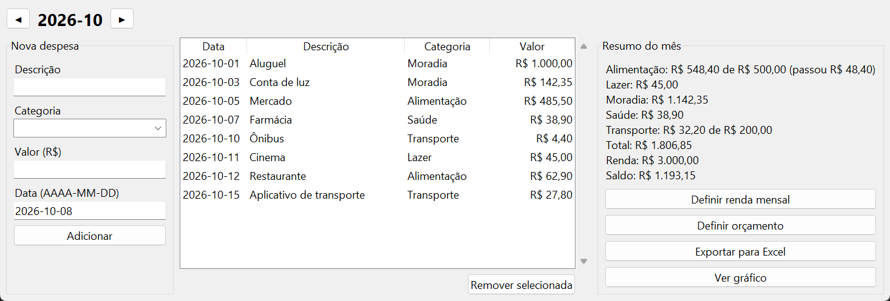
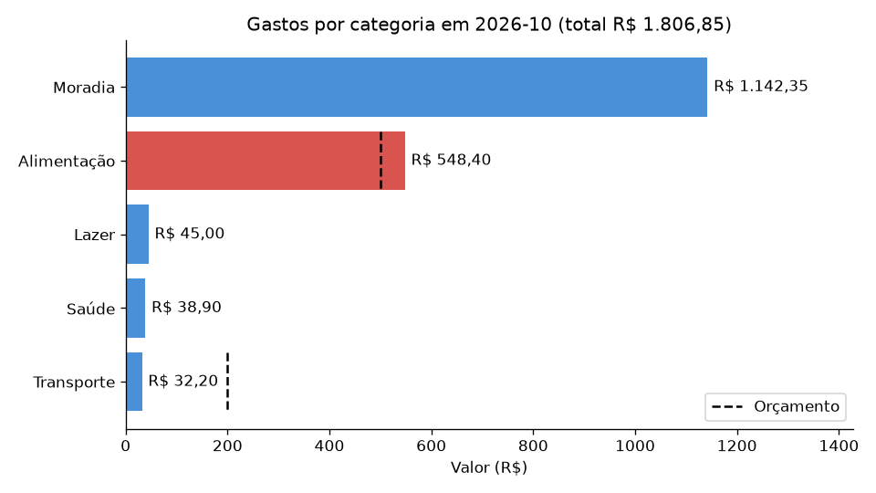

# 💰 Calculadora de Gastos Pessoais


Programa em Python para registrar despesas do dia a dia, organizá-las por categoria e acompanhar quanto foi gasto e quanto sobrou em cada mês. Funciona no **terminal** ou com **interface gráfica**, e os dados ficam salvos no seu computador.



## 🚀 Funcionalidades

- **Cadastrar despesas** com descrição, categoria, valor e data (Enter usa a data de hoje).
- **Listar** todas as despesas em ordem de data.
- **Resumo por categoria**, com o total de cada uma e o total geral.
- **Filtrar por mês**, vendo as despesas e o resumo só daquele período.
- **Renda mensal e saldo**: informe quanto você recebe e veja quanto sobra no mês.
- **Orçamento por categoria**: defina um limite (ex.: R$ 500 em Alimentação) e receba um aviso quando passar dele.
- **Editar ou remover** um lançamento, com confirmação antes de apagar.
- **Exportar o mês para Excel** (`.xlsx`), com uma aba de despesas e outra de resumo.
- **Gráfico de gastos por categoria**, destacando em vermelho o que passou do orçamento.
- **Validar o que é digitado**: aceita `25,90` ou `25.90`, recusa valores negativos e datas inválidas, e agrupa `alimentação` e `ALIMENTAÇÃO` na mesma categoria.

## 🛠️ Tecnologias

- Python 3
- Módulos nativos: `csv`, `json`, `datetime`, `decimal`, `tkinter` e `unittest`
- [openpyxl](https://openpyxl.readthedocs.io/) (Excel) e [matplotlib](https://matplotlib.org/) (gráficos)
- [ruff](https://docs.astral.sh/ruff/) para padronizar o estilo do código
- Git e GitHub Actions

## ▶️ Como executar

Pré-requisito: **Python 3.10 ou superior**.

```bash
git clone https://github.com/melissag-cruz/calculadora-gastos-pessoais.git
cd calculadora-gastos-pessoais
pip install -r requirements.txt
```

Depois, escolha como usar:

```bash
python interface.py   # interface gráfica
python main.py        # versão de terminal
```

> No Windows, se `python` não funcionar, use `py` no lugar.
>
> As bibliotecas do `requirements.txt` só são necessárias para exportar para Excel e gerar gráficos. Sem elas, todo o resto funciona normalmente.

## 📋 Exemplo de uso no terminal

```text
=== Calculadora de Gastos Pessoais ===
1. Adicionar despesa
2. Listar despesas
3. Ver resumo dos gastos
4. Ver gastos de um mês
5. Editar ou remover despesa
6. Definir renda mensal
7. Definir orçamento de uma categoria
8. Exportar relatório do mês para Excel
9. Gerar gráfico do mês
0. Sair
Escolha uma opção: 4

Mês (AAAA-MM; Enter para 2026-10):

--- Despesas de 2026-10 ---
2026-10-05 | Alimentação | Mercado | R$ 485,50
2026-10-10 | Transporte | Ônibus | R$ 4,40
2026-10-12 | Alimentação | Restaurante | R$ 62,90

--- Resumo de 2026-10 ---
Alimentação: R$ 548,40 de R$ 500,00 (passou R$ 48,40)
Transporte: R$ 4,40
Total: R$ 552,80
Renda: R$ 3.000,00
Saldo: R$ 2.447,20
```

## 📊 Gráfico do mês



A linha tracejada marca o orçamento de cada categoria. As barras em vermelho passaram do limite.

## 🧪 Testes e qualidade

O projeto tem testes automatizados com o módulo nativo `unittest`:

```bash
python -m unittest discover -s tests -t . -v
```

O estilo do código é verificado com o `ruff`:

```bash
pip install ruff
ruff check .
ruff format --check .
```

Os testes e o `ruff` rodam automaticamente no **GitHub Actions** a cada push, no Python 3.10 e no 3.12.

## 📁 Estrutura do projeto

```text
├── gastos.py                # Regras: despesas, renda, orçamentos e resumo do mês
├── main.py                  # Versão de terminal
├── interface.py             # Interface gráfica (tkinter)
├── relatorios.py            # Exportação para Excel e gráfico
├── requirements.txt         # Bibliotecas externas
├── pyproject.toml           # Configuração do ruff
├── docs/                    # Imagens do README
├── tests/                   # Testes automatizados
└── .github/workflows/
    └── testes.yml           # Integração contínua (CI)
```

A versão de terminal e a interface gráfica usam as mesmas regras do `gastos.py`, então as duas sempre calculam igual.

> 🔒 Seus dados (`despesas.csv`, `configuracoes.json` e a pasta `relatorios/`) estão no `.gitignore` e nunca são enviados ao GitHub.

## 📚 Aprendizados

Durante o desenvolvimento deste projeto pratiquei:

- Organizar o código em funções pequenas e em módulos com responsabilidades separadas
- Ler e gravar arquivos CSV e JSON
- Validar dados digitados pelo usuário
- Usar `Decimal` para trabalhar com dinheiro sem erros de arredondamento
- Criar uma interface gráfica com `tkinter`
- Gerar planilhas Excel e gráficos com bibliotecas externas
- Escrever testes automatizados
- Versionar com Git e configurar integração contínua no GitHub

## 🎯 Próximas melhorias

- Editar despesas também pela interface gráfica
- Despesas recorrentes (ex.: aluguel lançado automaticamente todo mês)
- Comparar os gastos de um mês com o mês anterior

## 👩‍💻 Autora

Feito por **Melissa Gomes Silva Cruz**.

[GitHub](https://github.com/melissag-cruz)
